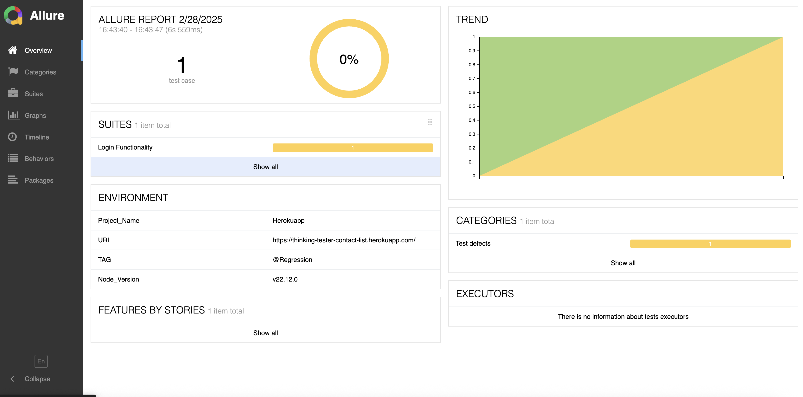
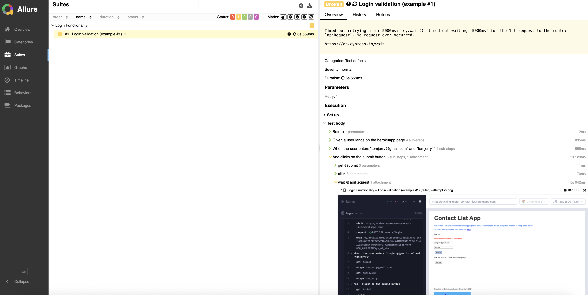
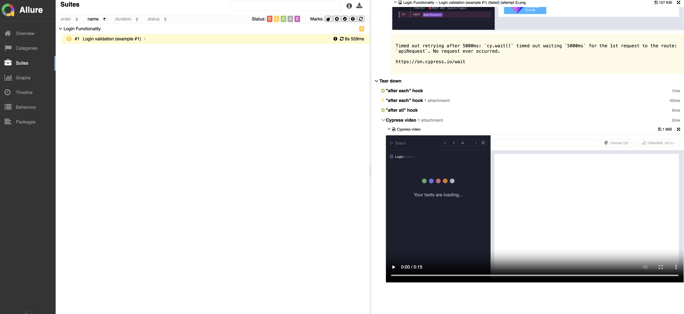
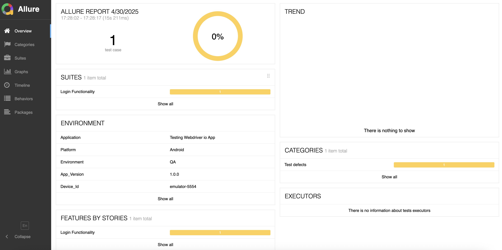
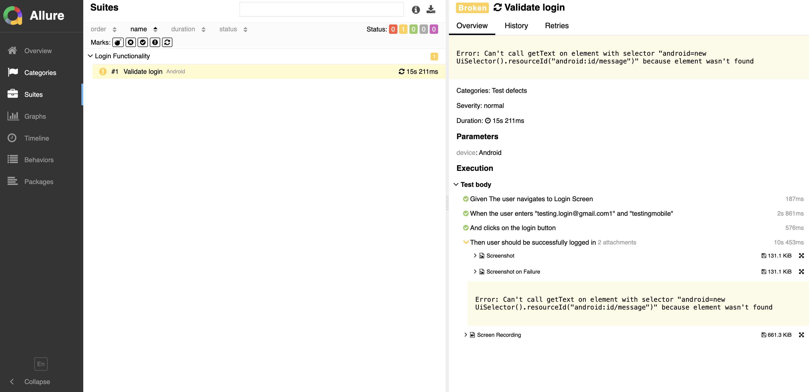

## Welcome to our Web & Mobile Automation Center of Excellence!

With deep-rooted expertise in Quality Assurance, Kombee's Automation Hub empowers businesses to deliver flawless software experiences. From enterprise-grade systems to startup solutions, we engineer robust, scalable, and intelligent test automation strategies across web, mobile, and API platforms.

---

## 🚀 Our Automation Expertise

We specialize in automation that delivers high velocity, accuracy, and confidence in every deployment:

### ✅ Web Automation

- 🌐 Robust UI test automation using **Cypress**, **Selenium** tailored for modern single-page apps (SPAs) and enterprise web platforms.
- 📝 Automates critical user journeys including **form submissions**, **tabular data handling**, **file upload/download**, and **interactive elements** like modals and dropdowns.
- 📊 Implements **data-driven testing** with fixtures and custom commands.
- 🌎 Validated across multiple browsers and screen sizes for **cross-browser** (Chrome, Edge, Firefox) and **responsive UI behavior** using Cypress Viewport & Device Emulation.
- 🔁 Integrated directly with CI/CD pipelines for automated test runs on every PR, commit, or deployment, with alerts on failures via **Slack** or **email**.

### 📱 Mobile Automation

- 🤖 End-to-end test automation for **native**, **hybrid**, and **mobile web apps** using **Appium**, enabling seamless cross-platform testing on Android and iOS.  
- 🎯 Automates complex scenarios including gestures (swipe, tap, scroll), OS version handling, **deep linking**, hardware simulations (camera, GPS).  
- 🧩 Built on a modular Page Object framework (TestNG/**WebDriverIO**), enabling **scalable, maintainable** test suites with rich reporting via **Allure** and **Mochawesome**.  
- 🌐 **WebDriverIO** provides unified support for both web and mobile automation, reducing the learning curve and improving test reusability across platforms.  
- 🛠️ We’ve **overridden platform-specific methods** in our framework to optimize test execution logic across Android and iOS, ensuring consistency and minimizing code duplication.
- 🚀 Fully integrated with CI/CD pipelines (**GitHub Actions**, **Jenkins**) to enable automated regression runs on pull requests, merges, or nightly builds.

---
## 🧱 Frameworks & Utilities

- 🧩 **Page Object** & Modular-based framework designs for better maintainability and separation of concerns  
- 🧠 Reusable custom **Cypress** commands to ensure scalable and DRY (Don't Repeat Yourself) test coverage  
- 🔁 Built-in **retry mechanism** to handle flaky UI tests—particularly useful in dynamic web/mobile environments and CI pipelines  
- 📸 Automatic screenshot and video logging on failure for faster debugging and root cause analysis  
- 📊 Rich reporting with **Allure**, **Mochawesome**, and **Slack integrations** for real-time test result notifications

---

## 🛠 CI/CD Integration

We empower DevOps workflows with automation-first pipelines:

- ✅ Test triggers on Pull Requests and Merges
- 🔁 Scheduled builds & environment-based test suites
- 📩 Auto alerts on Slack, Email, or Dashboards
- 🔄 GitHub Actions, Jenkins, CircleCI integrated

---

## 📦 Project Coverage & Demos

### 🔹 Use Case Scenarios:
- Login & Auth flows
- Campaign & Coupon validation
- Loyalty points & wallet testing
- Dashboard widget consistency
- Admin approval workflows

### 🔸 Demo Projects:
- [E2E Cypress Automation Framework](https://github.com/kombee-technologies/cypress-web-starter/blob/master/README.md)
- [Mobile Appium Framework](https://github.com/qahetalpatel/appium-mobile-starter.git)

### 🖼️ UI Screenshots:

---

## 🧪 Test Strategy & Quality Process

### 1. 📋 Planning & Prioritization
- Risk-based test planning to ensure high-impact and business-critical functionalities are tested first  
- Alignment with acceptance criteria to maintain traceability from requirements to test cases  
- Strategic **test data planning**—we identify and prepare meaningful data sets early, tailored to cover edge cases, negative scenarios, and real-world user flows  
- Early involvement in requirement discussions to assess feasibility, clarify ambiguities, and highlight test dependencies

### 2. 🔨 Framework Development
- Modular, scalable, readable code
- Smart selectors & wait strategies

### 3. 🚦 Execution & Monitoring
- Local + cloud runs
- Smart retry + failure diagnostics

### 4. 📊 Reporting & Feedback
- Real-time dashboards
- Test coverage & flakiness analysis

### 5. 📘 BDD Structure & Collaboration
- We follow the **BDD (Behavior Driven Development)** approach using **Cucumber** with `.feature` files written in **simple English (Gherkin syntax)**—`Given`, `When`, `Then`—to define clear and testable behavior.  
- Enables **cross-functional collaboration** by allowing product owners, testers, and developers to all contribute to or understand test scenarios.  
- Enhances **traceability from requirements to tests**, ensuring business rules are covered and understood.  
- Promotes **reusability** of step definitions across multiple scenarios, reducing maintenance effort and increasing consistency.  
- Helps clients and stakeholders **visualize test coverage** and **understand business flow validations** without needing to read code.

---

## 🌟 Why Choose Kombee QA?
- ✅ Automation-first quality mindset
- ⚡ Lightning-fast execution with modern tools
- 🧩 Modular, reusable, future-proof frameworks
- 🧠 QA team with deep product and domain knowledge
- 🔁 Always-on regression pipeline with feedback loops

---

## 🌐 Let’s Connect
We’re here to help automate your QA lifecycle. Let’s innovate together!

- **Website**: [www.kombee.com](https://www.kombee.com)
- **Email**: contact@kombee.com
- **LinkedIn**: [Kombee Technologies](https://in.linkedin.com/company/kombee-global)
- **Twitter**: [@KombeeTech](https://x.com/kombeeglobal)

> Trust Kombee to scale your automation — from test case to production!
